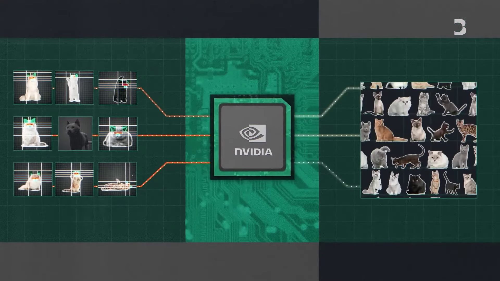

# Introducción a la IA

Guillermo Valdés (@guivaloz)

Marzo 2025

---

# Descargo de responsabilidad

Esta presentación es solo para fines informativos y no debe considerarse como asesoramiento profesional o técnico. El contenido de esta presentación es una recopilación de información pública y no refleja necesariamente la opinión o posición de ninguna organización o entidad.

---

---

# Qué es la Inteligencia Artificial (IA|AI)

La inteligencia artificial es la simulación de procesos de inteligencia humana por parte de máquinas, especialmente sistemas informáticos.

Estos procesos incluyen el aprendizaje (la adquisición de información y reglas para el uso de la información), el razonamiento (usando reglas para llegar a conclusiones aproximadas o definitivas) y la autocorrección.

---

---

# Momentos históricos

- **1950**: Alan Turing publica "Computing Machinery and Intelligence", donde propone la "Prueba de Turing".
- **1956**: John McCarthy acuña el término "Inteligencia Artificial" en la conferencia de Dartmouth.
- **1997**: Deep Blue de IBM vence a Garry Kasparov en una partida de ajedrez.
- **2011**: Watson de IBM vence a los campeones humanos en el programa de televisión Jeopardy.
- **2016**: AlphaGo de Google DeepMind vence a Lee Sedol en el juego de Go.

---

---

# ¿Qué hace un LLM?

LLM significa Modelo de Lenguaje Extenso o _Large Language Model._

- **Predice la siguiente palabra:** Se entrena con enormes cantidades de texto (libros, artículos, sitios web, código, etc.) y aprende a predecir la siguiente palabra en una secuencia.
- **Genera texto coherente** y **entiende el contexto.**
- **Se entrenan** con **cantidades masivas** de datos de texto, imágenes, videos, audios, etc.
- **Cuantos más parámetros,** más complejo es el modelo y más capaz es de aprender patrones en los datos.
Un LLM es una herramienta poderosa que puede generar texto, responder preguntas y realizar otras tareas relacionadas con el lenguaje.

---

---

# Limitaciones de los LLM

- **Falta de comprensión real:** Aunque pueden generar texto que suena convincente, los LLM no "entienden" el mundo de la misma manera que los humanos. Simplemente están prediciendo la siguiente palabra basándose en patrones que han aprendido.
- **Alucinaciones:** Pueden inventar información o presentar información incorrecta como si fuera un hecho.
- **Sesgos:** Pueden reflejar los sesgos presentes en los datos con los que fueron entrenados.
- **Costo:** Entrenar y ejecutar LLM es muy costoso.

---

---

# Usos de la IA en el presente (marzo 2025)

- **Reconocimiento de voz**: Siri, Alexa, Google Assistant.
- **Reconocimiento de imágenes**: Google Photos, Facebook.
- **Recomendaciones**: Netflix, Amazon, Spotify.
- **Juegos**: AlphaGo, Deep Blue.
- **Conducción autónoma**: Tesla, Waymo.
- **Medicina**: Diagnóstico, investigación.
- **Finanzas**: Predicción de mercados, fraudes.
- **Educación**: Tutores virtuales, personalización del aprendizaje.

---

---

# Tendencias al futuro de la IA

- **Agentes, gafas y asistentes**
- **Medicina personalizada**
- **Genética**
- **Robótica**
- **Energías renovables y sustentables**
- **Computación cuántica**

---

---

# Consideraciones éticas

- **Sustitución de personas por máquinas en el trabajo**
- **Peligran los trabajos creativos**
- **Sesgo (bias)**
- **Privacidad**

---

# Inteligencia Artificial General

La inteligencia artificial general (AGI) es un tipo de inteligencia artificial que puede entender, aprender y aplicar conocimientos en una variedad de tareas, similar a la inteligencia humana. A diferencia de los sistemas de IA actuales, que están diseñados para tareas específicas, la AGI tendría la capacidad de razonar, planificar y resolver problemas en múltiples dominios.

---

# Ejecutar modelos LLM en nuestra computadora

- **Requisitos**: GPU potente (VRAM), memoria RAM suficiente, espacio en disco.
- **Software**: Ollama, LLMStudio.
- **Modelos**: Llama, Mistral, Phi, Deepseek, QWEN,
- **Desarrollo**: Python, PyTorch, TensorFlow.

---

---

# Reflexiones finales

- ¿Crees que puede ocurrir una apocalipsis como en la película Terminator?
- ¿O en que habrá una edad dorada de la humanidad, con humanos y máquinas trabajando juntos?
- ¿Cómo crees que va a ser el mundo en 25 años?

---

